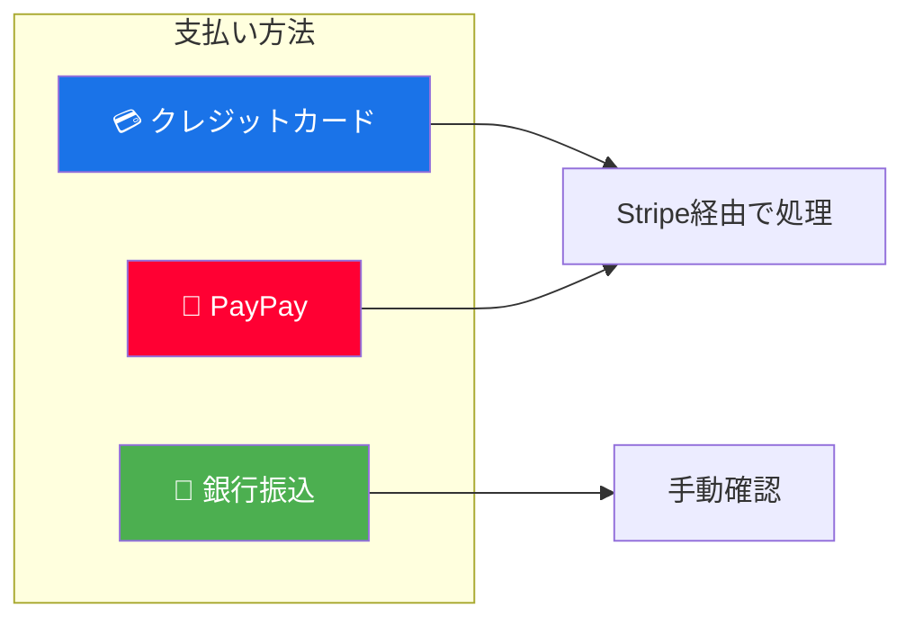
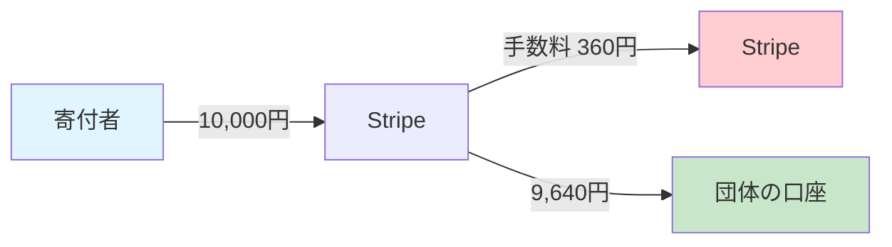
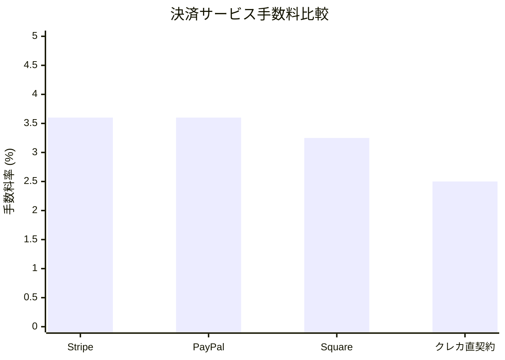
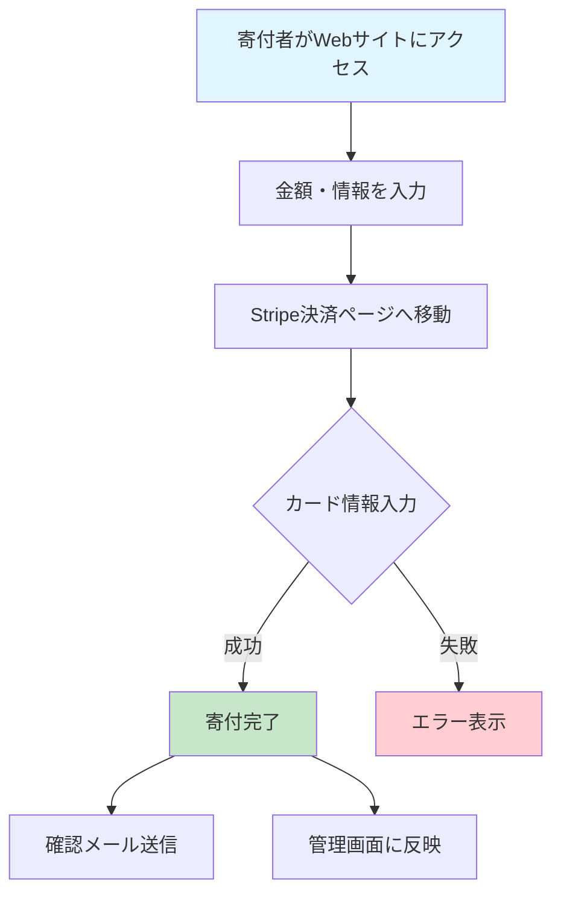
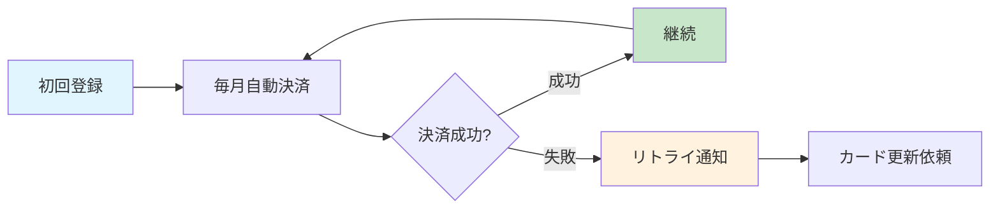
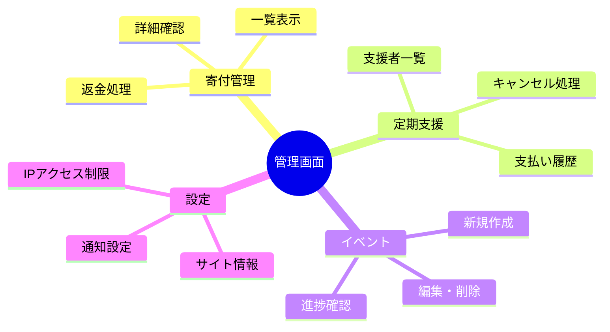
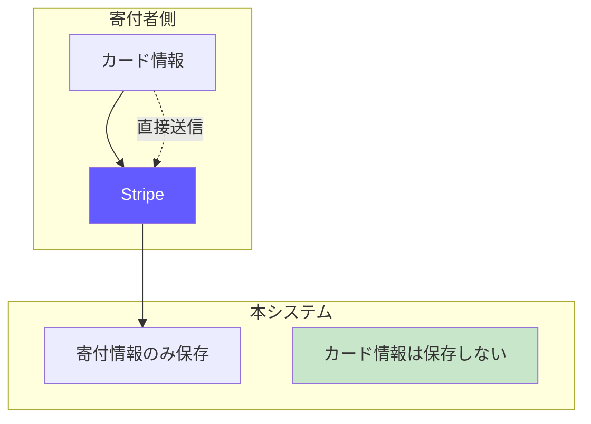
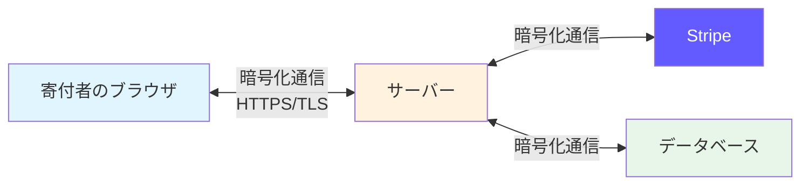
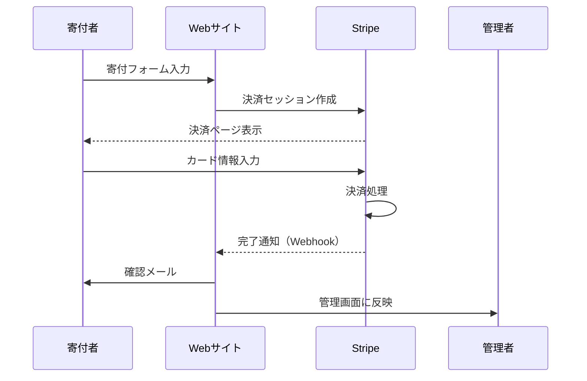

# Monobun Donation - サービス概要

## このサービスについて

Monobun Donationは、NPO法人や団体が**オンラインで寄付を受け付けるためのシステム**です。
Webサイトに設置するだけで、クレジットカード決済による寄付受付が可能になります。

---

## 主な特徴

### 1. 多様な寄付形態に対応

| 寄付タイプ | 説明 |
|-----------|------|
| **単発寄付** | 1回限りの寄付（金額は自由に設定可能） |
| **月額サポーター** | 毎月自動で寄付される継続支援 |
| **年額サポーター** | 年1回自動で寄付される継続支援 |
| **イベント寄付** | 特定のキャンペーンや災害支援向け |

### 2. 簡単な導入

```
ウェブサイトにコードを貼り付けるだけで設置完了
↓
すぐに寄付受付を開始
```

### 3. 管理画面で一元管理

- 寄付履歴の確認
- 定期支援者の管理
- イベント（キャンペーン）の作成・編集
- 返金処理
- 統計データの確認

---

## 対応している支払い方法



### クレジットカード / デビットカード

| ブランド | 対応状況 |
|---------|---------|
| Visa | ✅ 対応 |
| Mastercard | ✅ 対応 |
| American Express | ✅ 対応 |
| JCB | ✅ 対応 |
| Diners Club | ✅ 対応 |
| Discover | ✅ 対応 |

### その他の支払い方法

| 方法 | 対応状況 | 備考 |
|------|---------|------|
| PayPay | ✅ 対応 | QRコード決済 |
| 銀行振込 | ✅ 対応 | 入金確認は手動 |
| コンビニ払い | 🔄 検討中 | Stripe経由で対応可能 |
| Apple Pay | ✅ 対応 | Stripe経由 |
| Google Pay | ✅ 対応 | Stripe経由 |

---

## 手数料について

### 手数料の仕組み



### Stripe決済手数料（日本）

| 項目 | 手数料率 | 備考 |
|------|---------|------|
| **クレジットカード** | **3.6%** | 全ブランド共通 |
| デビットカード | 3.6% | クレジットと同じ |
| Apple Pay / Google Pay | 3.6% | クレジットと同じ |

> ※ 手数料は決済ごとに発生し、振込時に差し引かれます

### 手数料計算例

| 寄付金額 | 手数料 (3.6%) | 実際に届く金額 |
|---------:|-------------:|--------------:|
| ¥1,000 | ¥36 | **¥964** |
| ¥3,000 | ¥108 | **¥2,892** |
| ¥5,000 | ¥180 | **¥4,820** |
| ¥10,000 | ¥360 | **¥9,640** |
| ¥30,000 | ¥1,080 | **¥28,920** |
| ¥50,000 | ¥1,800 | **¥48,200** |
| ¥100,000 | ¥3,600 | **¥96,400** |

### 定期支援（サブスクリプション）の手数料

月額・年額の定期支援も、**毎回の決済ごとに3.6%の手数料**がかかります。

| 支援タイプ | 月額 | 年間手数料 | 年間受取額 |
|-----------|-----:|-----------:|-----------:|
| 月額 ¥1,000 | ¥36/月 | ¥432/年 | **¥11,568** |
| 月額 ¥3,000 | ¥108/月 | ¥1,296/年 | **¥34,704** |
| 月額 ¥5,000 | ¥180/月 | ¥2,160/年 | **¥57,840** |
| 年額 ¥12,000 | - | ¥432/年 | **¥11,568** |

### その他の費用

| 項目 | 費用 | 備考 |
|------|------|------|
| 返金手数料 | **無料** | Stripe側の手数料は返金されない |
| 振込手数料 | **無料** | Stripeから銀行口座への振込 |
| 月額固定費 | **無料** | Stripeは従量課金のみ |
| チャージバック | ¥1,500/件 | 不正利用等で発生した場合 |

### 手数料の比較



| サービス | 手数料率 | 備考 |
|---------|---------|------|
| **Stripe（本システム）** | 3.6% | 初期費用・月額無料 |
| PayPal | 3.6% + ¥40 | 固定費あり |
| Square | 3.25% | 対面決済向け |
| クレカ直契約 | 2.0〜3.5% | 審査・開発コスト大 |

> 💡 **ポイント**: Stripeは初期費用・月額費用がゼロで、手数料のみの完全従量課金のため、寄付額が少ない時期でもリスクなく始められます。

---

## 寄付の流れ



### ステップ詳細

| ステップ | 寄付者の操作 | システムの動作 |
|---------|-------------|---------------|
| 1 | 寄付ページにアクセス | 寄付フォームを表示 |
| 2 | 金額を選択・入力 | 入力値をチェック |
| 3 | メールアドレス等を入力 | 形式を確認 |
| 4 | 「寄付する」ボタンをクリック | Stripeに接続 |
| 5 | カード情報を入力（Stripe画面） | 決済処理 |
| 6 | 完了画面を確認 | 確認メール送信 |

---

## 定期支援（サブスクリプション）の仕組み



- 初回の登録後、毎月（または毎年）自動で決済
- カードの有効期限切れなどで失敗した場合は通知メール送信
- 支援者はいつでもキャンセル可能（専用リンクから）

---

## 管理画面でできること



### 主な機能

| 機能 | 説明 |
|------|------|
| **寄付一覧** | すべての寄付を日時順に確認 |
| **統計ダッシュボード** | 総額、件数、達成率をグラフで表示 |
| **返金処理** | 間違いや要望に応じて返金 |
| **イベント管理** | 目標金額付きキャンペーンを作成 |
| **アクセス制限** | 管理画面に入れるIPを制限 |

---

## セキュリティ対策

### 寄付者の安全を守る仕組み



**重要**: カード番号はStripe（世界最大級の決済サービス）が直接処理し、本システムには**一切保存されません**。

### 管理者アカウントの保護

| 対策 | 説明 |
|------|------|
| **強力なパスワード** | 12文字以上、大文字・小文字・数字を含む |
| **ログイン試行制限** | 5回失敗で30分間ロック |
| **不正アクセス検知** | 異常なアクセスパターンを監視 |
| **セッション管理** | 30分操作がないと自動ログアウト |
| **IP制限** | 許可されたIPからのみアクセス可能 |

### 通信の安全性



すべての通信は**HTTPS（暗号化通信）**で保護されており、第三者に内容を見られることはありません。

### 不正防止の仕組み

| 脅威 | 対策 |
|------|------|
| **なりすまし** | CSRF対策トークンで防御 |
| **大量リクエスト攻撃** | レート制限で1分間のリクエスト数を制限 |
| **不正な決済** | Stripe署名検証で正規の通知のみ処理 |
| **二重決済** | 冪等性キーで同じ処理の重複を防止 |

---

## データの流れ



---

## よくある質問

### Q. カード情報は安全ですか？

**A.** はい、安全です。カード情報は世界最大級の決済サービス「Stripe」が直接処理し、本システムには一切保存されません。Stripeは銀行レベルのセキュリティ基準（PCI DSS Level 1）を満たしています。

### Q. 管理者アカウントが乗っ取られる心配は？

**A.** 複数の対策で保護しています：
- 強力なパスワード要件
- ログイン失敗時のアカウントロック
- IPアドレス制限（オプション）
- 自動ログアウト機能

### Q. 定期支援のキャンセルは簡単ですか？

**A.** はい。支援者には専用のキャンセルリンクが送られ、ワンクリックでキャンセル可能です。管理者側からもキャンセル処理ができます。

### Q. 返金はできますか？

**A.** はい。管理画面から全額返金・一部返金どちらも可能です。返金処理はStripe経由で自動的に行われます。

---

## 技術仕様（参考）

| 項目 | 内容 |
|------|------|
| 開発言語 | TypeScript |
| ランタイム | Bun |
| データベース | PostgreSQL |
| 決済 | Stripe |
| ホスティング | Docker対応 |

---

## お問い合わせ

ご不明な点がございましたら、システム管理者までお問い合わせください。
